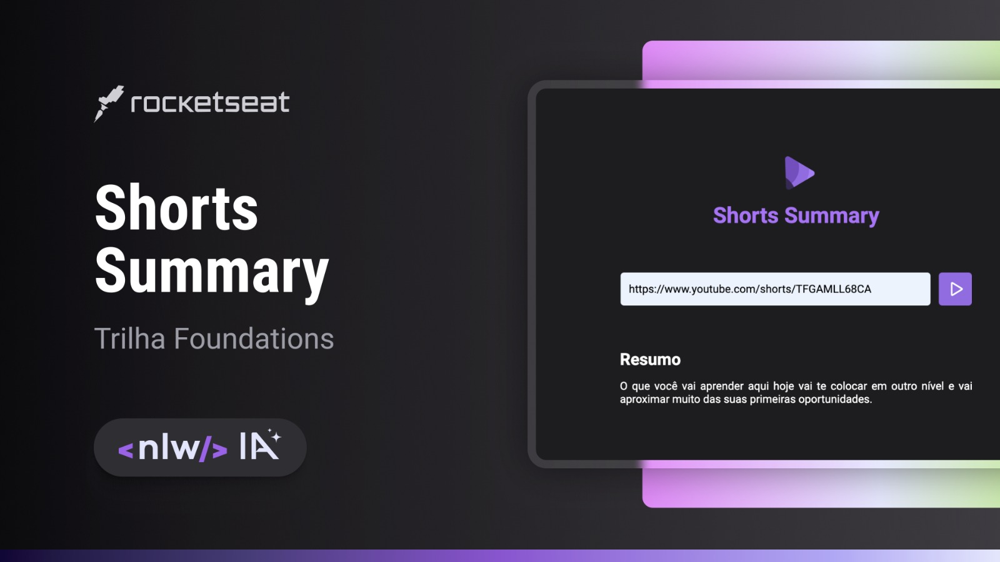

<p align='center'>
  
</p>

<p align="center">
  Aplicação construída no NLW AI da Rocketseat na trilha Foundations.
</p>

<p align="center">
  <a href="#%EF%B8%8F-sobre-o-projeto">Sobre o Projeto</a>&nbsp;&nbsp;&nbsp;|&nbsp;&nbsp;&nbsp;
  <a href="#%EF%B8%8F-tecnologias">Tecnologias</a>&nbsp;&nbsp;&nbsp;|&nbsp;&nbsp;&nbsp;
  <a href="#-rodando-o-projeto-localmente">Rodando o projeto localmente</a>
</p>

<br>

<p align="center">
  
</p>

## 🗒️ Sobre o projeto
Desenvolvida na trilha Foundations na edição NLW IA da Rocketseat, Shorts Summary é uma aplicação web que cria a transcrição e resumo do conteúdo de vídeos shorts do Youtube utilizando Inteligência Artificial da WhisperAI (Transformers.js).

## 🛠️ Tecnologias
- [HTML5](https://html.spec.whatwg.org/multipage/)
- [CSS3](https://www.w3.org/Style/CSS/Overview.en.html)
- [JavaScript](https://developer.mozilla.org/pt-BR/docs/Web/JavaScript)
- [Node.js](https://nodejs.org/en)
- [Express](https://expressjs.com/)
- [Axios](https://axios-http.com/)
- [YTDL](https://www.npmjs.com/package/ytdl-core)
- [FFmpeg](https://ffmpeg.org/)
- [Node-wav](https://github.com/andreasgal/node-wav)
- [Transformers.js](https://github.com/xenova/transformers.js/)

## 💻 Rodando o projeto localmente
```bash
# Clone este repositório
$ git clone https://github.com/welisonw/nlw13_2023-foundations-shorts-summary.git

# Entre na pasta do projeto
$ cd nlw13_2023-foundations-shorts-summary

# Instale as dependências
$ npm install  ou  yarn install  ou  pnpm install

# Inicie o projeto
$ npm run dev  ou  yarn run dev  ou  pnpm run dev
$ npm run server  ou  yarn run server  ou  pnpm run server

# O app vai inicializar em http://localhost:5173/
```
